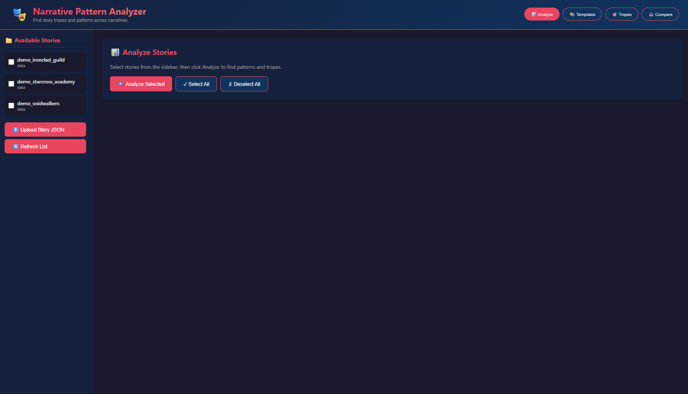
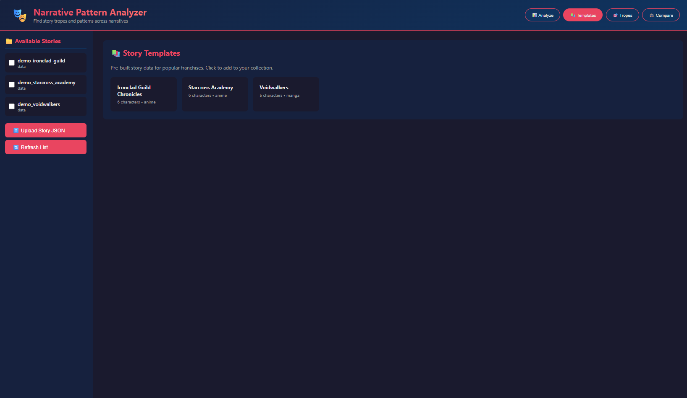
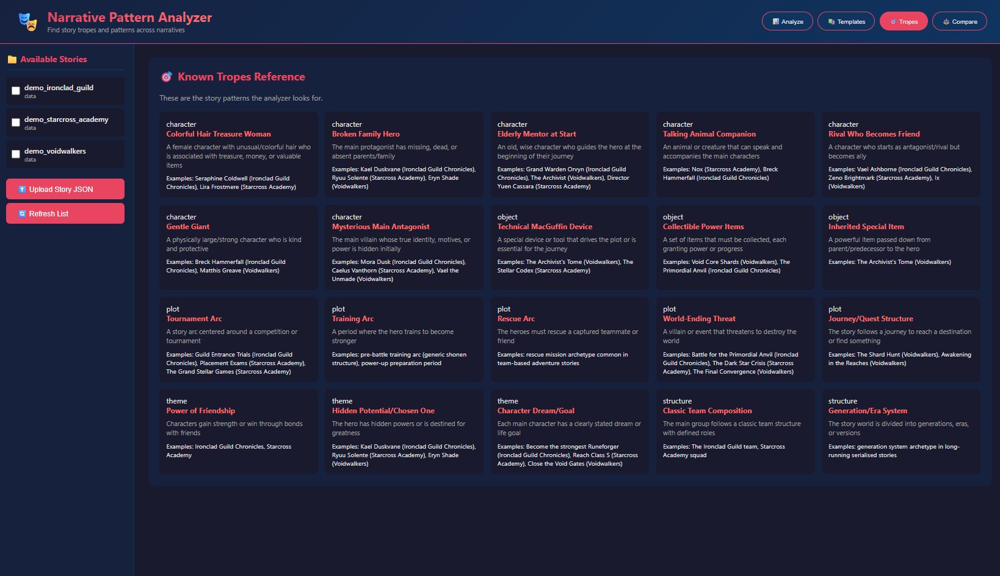

# Narrative Pattern Analyzer

A Python-based analysis tool that detects recurring story tropes, character archetypes, and cross-narrative patterns across anime, manga, games, movies, books, and other media. Load story data from JSON files, run the analysis engine, and receive reports in plain text, JSON, and HTML formats.

---

## Screenshots

| Analyze | Templates | Tropes |
|---------|-----------|--------|
|  |  |  |

---

## Features

- **Trope Detection** — Matches characters, objects, and plot arcs against a catalogue of 20 pre-defined narrative tropes (e.g. *Broken Family Hero*, *Tournament Arc*, *Collectible Power Items*)
- **Archetype Matching** — Scores every character against 7 canonical archetypes (The Hero, The Mentor, The Rival, etc.)
- **Cross-Story Similarity** — Finds structurally equivalent characters across different titles using trait-overlap scoring with synonym expansion
- **Pattern Discovery** — Mines the full corpus for novel trait combinations that recur across stories but are not yet named tropes
- **Multiple Report Formats** — Exports analysis results as `.txt`, `.json`, and styled `.html` files
- **Flask Web GUI** — Interactive browser-based interface for uploading stories, browsing results, and downloading reports (`gui.py`)
- **CLI Interface** — Six sub-commands (`analyze`, `compare`, `tropes`, `archetypes`, `template`, `character`) via `main.py`
- **Data Scrapers** — Two CLI tools in `tools/` for auto-generating story JSON from Fandom wikis (via MediaWiki API or HTML fallback) and MyAnimeList (via Jikan API, no key required)
- **Story Generator** — Template-based story JSON generator with three pre-built original demo universes

---

## Project Structure

This project follows a strict **one class per file** modular architecture. Every class lives in its own dedicated file inside the `SBS/` (Story Building System) package. Root-level files are thin entry-point scripts only.

```
narrative-analyzer/
│
├── main.py                    # CLI entry point (6 sub-commands)
├── gui.py                     # Flask web GUI — main entry point
├── story_generator.py         # Story template generator + demo data
├── config.py                  # Trope catalogue, archetypes, weights
│
├── SBS/                       # Core package — one class per file
│   ├── __init__.py            # Central re-export hub
│   ├── Gender.py
│   ├── CharacterRole.py
│   ├── StoryCategory.py
│   ├── Character.py
│   ├── StoryObject.py
│   ├── PlotArc.py
│   ├── Story.py
│   ├── StoryCollection.py
│   ├── TropeMatch.py
│   ├── SimilarityMatch.py
│   ├── DiscoveredPattern.py
│   ├── PatternMatcher.py
│   ├── ArchetypeMatcher.py
│   ├── ReportGenerator.py
│   ├── NarrativeAnalyzerGUI.py
│   ├── ScrapedCharacter.py
│   ├── FandomScraper.py
│   ├── FandomScraperHTML.py
│   └── MALScraper.py
│
├── tools/                     # CLI scraper entry points
│   ├── scraper_api.py         # Fandom (MediaWiki API) + MAL
│   └── scraper_html_fallback.py  # Fandom (HTML, bypasses blocks) + MAL
│
└── data/                      # Story JSON files (input)
```

---

## Setup & Execution

### Requirements

- Python 3.10 or higher (3.13 recommended)
- Windows / macOS / Linux

### 1. Create and populate a virtual environment

```bash
py -3.13 -m venv .venv
```

Then install dependencies:

**Windows (PowerShell — if script execution is blocked, call pip directly):**
```powershell
.venv\Scripts\python.exe -m pip install flask requests beautifulsoup4 matplotlib seaborn pandas numpy werkzeug
```

**macOS / Linux:**
```bash
source .venv/bin/activate
pip install flask requests beautifulsoup4 matplotlib seaborn pandas numpy werkzeug
```

### 2. Run the application

> **Windows note:** If PowerShell blocks `.ps1` activation scripts, call `python.exe` directly as shown below — no activation needed.

#### Command-Line Interface
```powershell
# Analyze all stories in data/ and write reports to output/
.venv\Scripts\python.exe main.py analyze ./data -o ./output

# Compare two stories side by side
.venv\Scripts\python.exe main.py compare data/demo_ironclad_guild.json data/demo_starcross_academy.json

# List all known tropes
.venv\Scripts\python.exe main.py tropes

# Generate a blank story template
.venv\Scripts\python.exe main.py template "My Story" -o data/my_story.json

# Analyse a single character
.venv\Scripts\python.exe main.py character data/demo_ironclad_guild.json "Kael Duskvane"
```

#### Web GUI (Flask)
```powershell
.venv\Scripts\python.exe gui.py
```
Then open **http://localhost:5000** in your browser.

#### Data Scrapers

> **Note:** The scrapers are provided as a technical demonstration only. Any data collected by running them belongs to the respective rights holders and must not be committed to the repository (enforced by `.gitignore`). See the Disclaimer section below.

```powershell
# Scrape from a Fandom wiki (API method)
.venv\Scripts\python.exe tools/scraper_api.py fandom <wiki-name> -o data/output.json

# Scrape with HTML fallback (for wikis that block the API)
.venv\Scripts\python.exe tools/scraper_html_fallback.py fandom <wiki-name> -o data/output.json

# Scrape from MyAnimeList
.venv\Scripts\python.exe tools/scraper_api.py mal "<Anime Title>" -o data/output.json
```

### 3. Story JSON format

Story files live in the `data/` directory. Use the template command to generate a starting file:

```powershell
.venv\Scripts\python.exe main.py template "My Story" -o data/my_story.json
```

---

## Disclaimer & Legal Notice

This project is a **proof-of-concept created strictly for educational and non-commercial purposes** as part of personal professional training in software development and data analysis.

**Regarding scraped content:**
- The web scrapers included in this repository are provided solely to demonstrate technical skills in API integration, HTML parsing, and data pipeline design.
- Any character names, story data, images, or other content obtained by running these scrapers belong entirely to their respective copyright holders (wiki publishers, MyAnimeList, and the original creators of each franchise).
- **This repository does not host, distribute, or reproduce any third-party intellectual property.** All scraped data files are explicitly excluded from version control via `.gitignore`.
- The demo datasets (`data/demo_*.json`) included in this repository contain entirely fictional, original characters and worlds created specifically for this project. They have no affiliation with any existing franchise, brand, or copyright holder.

**Regarding scraping conduct:**
- All scrapers implement mandatory randomised delays between requests to avoid overloading servers and to comply with the rate-limiting policies described in the respective Terms of Service.
- This tool is not intended for mass data collection, commercial use, or any purpose that violates a website's Terms of Service.

If you are a rights holder and have any concerns about this repository, please open an issue and the content will be reviewed and removed promptly.

---

## Development Note

This project was developed, polished, and refactored with the assistance of Artificial Intelligence.
